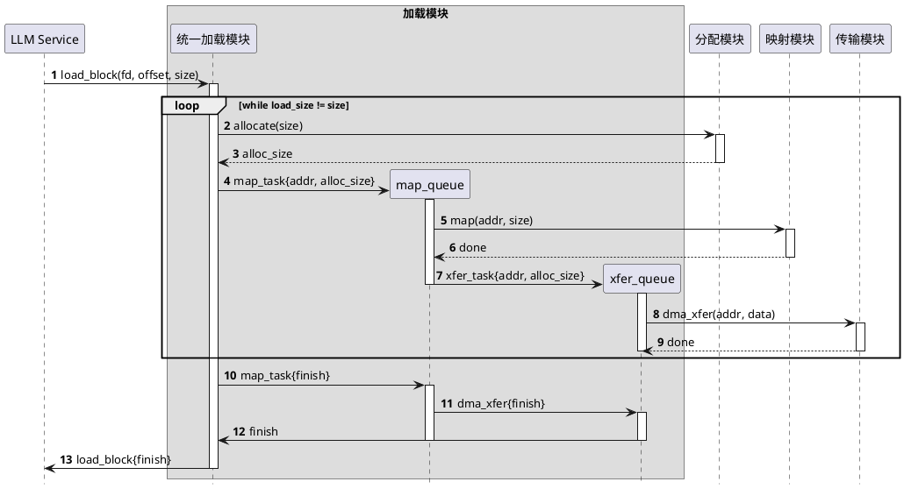
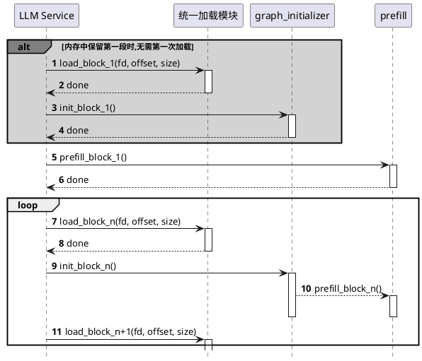

统一加载模块

```puml
@startuml
'https://plantuml.com/sequence-diagram

autonumber
hide footbox
participant "LLM Service" as llm

box "加载模块"
participant "统一加载模块" as loader
participant map_queue
participant xfer_queue
end box

participant "分配模块" as allocator
participant "映射模块" as mapper
participant "传输模块" as storage


llm -> loader++: load_block(fd, offset, size)
loop while load_size != size
loader -> allocator++: allocate(size)
allocator --> loader--: alloc_size

loader -> map_queue**: map_task{addr, alloc_size}
activate map_queue
map_queue -> mapper++: map(addr, size)
mapper --> map_queue--: done

map_queue -> xfer_queue**: xfer_task{addr, alloc_size}
map_queue--
activate xfer_queue
xfer_queue -> storage++: dma_xfer(addr, data)
storage --> xfer_queue--: done
xfer_queue--
end

loader -> map_queue++: map_task{finish}
map_queue -> xfer_queue++: dma_xfer{finish}
xfer_queue -> loader: finish
xfer_queue--
map_queue--
loader -> llm: load_block{finish}
loader--

@enduml
```
分段加载并prefill:

```puml

@startuml
'URL_ADDRESS'https://plantuml.com/sequence-diagram
autonumber
hide footbox
participant "LLM Service" as llm
participant "统一加载模块" as loader
participant graph_initializer
participant prefill

alt#Gray #LightGray 内存中保留第一段时,无需第一次加载 
llm -> loader++: load_block_1(fd, offset, size)
loader --> llm-- : done
llm -> graph_initializer++: init_block_1()
graph_initializer --> llm-- : done
end alt

llm -> prefill++: prefill_block_1()
prefill --> llm-- : done

loop
llm -> loader++: load_block_n(fd, offset, size)
loader --> llm-- : done
llm -> graph_initializer++: init_block_n()
graph_initializer --> prefill++ : prefill_block_n()
graph_initializer--
prefill--

llm -> loader++: load_block_n+1(fd, offset, size)
end loop


@enduml
```